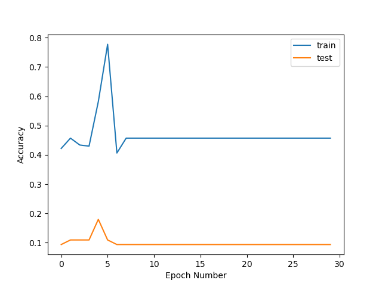
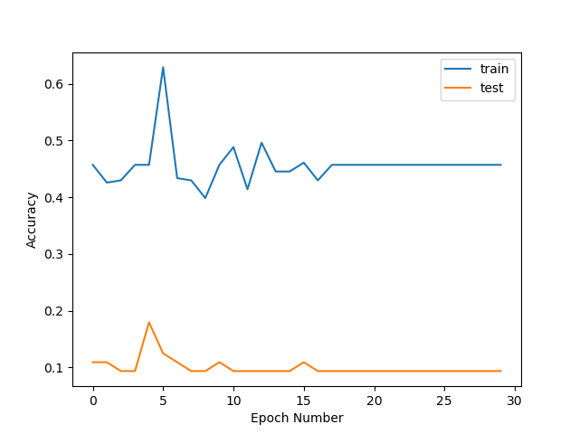
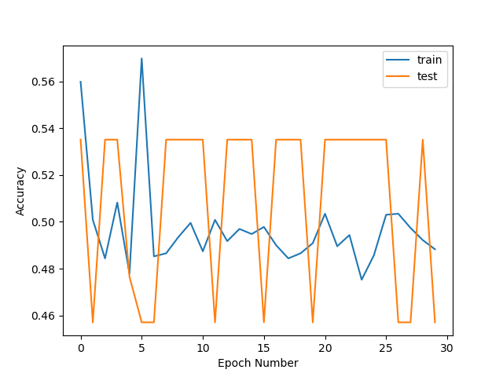
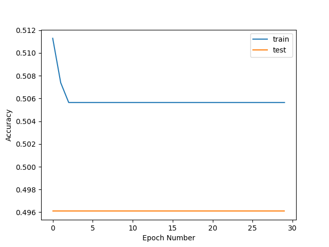

# Welcome! 

This is my quickly thrown together site for CSE455. I really didn't have a whole of time to work on this, but I hope it gives you a little insight on my project. For a overview, please watch the video below!

**Video**
 

**Summary**

**Graphs** \\
The Graphs I used in the presentation:

 \\
*First attempts at training the model*

 \\
*Turning down learning rate and model complexity in hopes of converging slower*

 \\
*Resulting unstable model after sampling the data every 2 seconds*

 \\
*Using the same sample rate, but tuning the model to reduce variance*

[**Code**](main.py)

[**Final Training Data**](https://drive.google.com/drive/folders/1ndq3LGVre4r7xSa80bFePWvEAPejoSE_?usp=share_link)

**Thank You** \\
Thank you for taking the time to review this! Please email me at jzhang66@uw.edu if you have any questions or things needed for grading.
